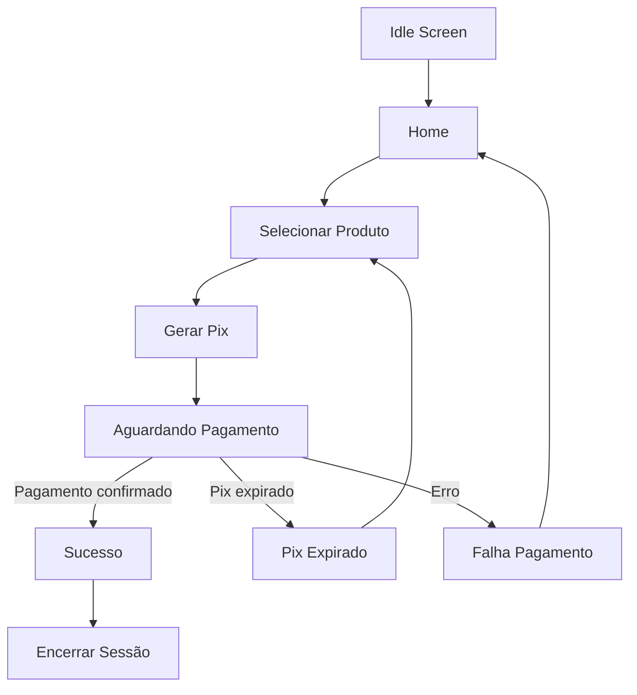
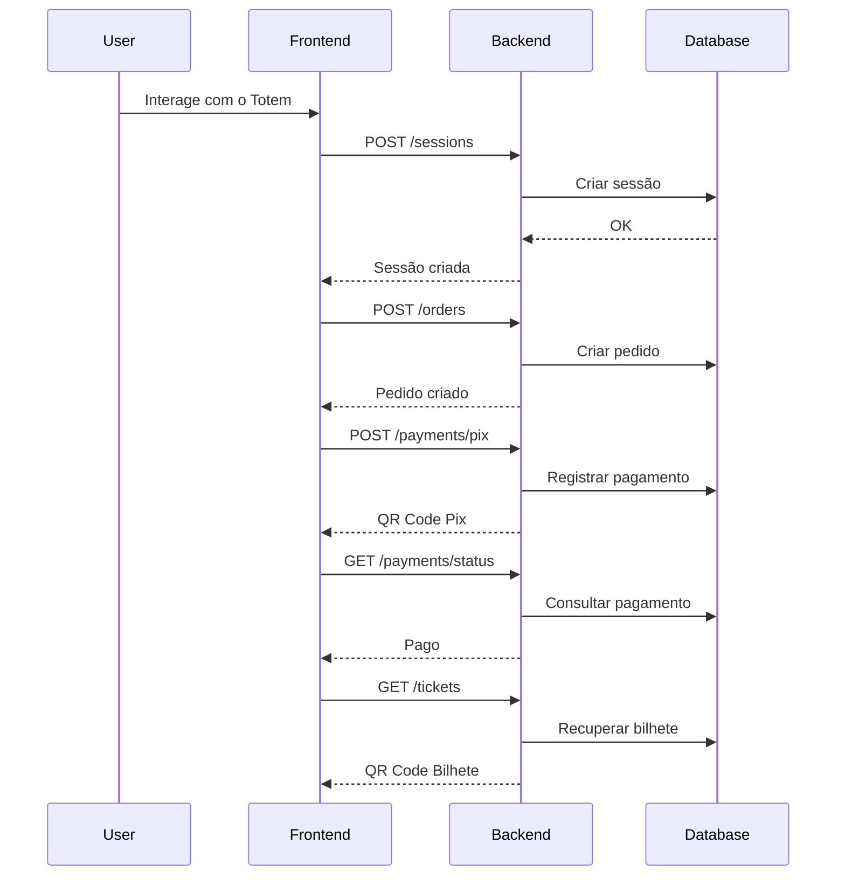

# 🚇 Metro DF Totem — Frontend Web

Frontend do **MVP de Totem de Autoatendimento para Bilhete Digital do Metrô-DF**.

Esta aplicação é responsável por:

- interface do **totem de autoatendimento**
- fluxo de compra do bilhete
- geração e exibição do **QR Code Pix**
- acompanhamento do pagamento
- visualização do **bilhete eletrônico**
- compartilhamento do bilhete no celular

O frontend consome as APIs REST fornecidas pelo backend Flask.

---

# 📌 Visão Geral da Arquitetura

A aplicação foi construída como **Single Page Application (SPA)**.

```text
Frontend (React + Vite)
        │
        │ REST API
        ▼
Backend (Python + Flask)
        │
        ▼
MySQL
```

O frontend roda em dois contextos:

1️⃣ **Totem físico (modo quiosque)**  
2️⃣ **Página web do bilhete no celular do usuário**

---

# ⚙️ Stack Tecnológica

## Framework

- React 18
- TypeScript

## Build Tool

- Vite

## Estilização

- Tailwind CSS
- PostCSS

## Componentes UI

- shadcn/ui
- Radix UI

## Gerenciamento de Estado

- React Hooks

## Ferramentas de Qualidade

- ESLint
- Vitest

---

# 📦 Estrutura do Projeto

```text
frontend/
│
├── index.html
├── package.json
├── vite.config.ts
├── tailwind.config.ts
│
├── public/
│
└── src/
    │
    ├── main.tsx
    ├── App.tsx
    │
    ├── pages/
    │
    │   ├── kiosk/
    │   │   ├── KioskIdle.tsx
    │   │   ├── KioskHome.tsx
    │   │   ├── KioskProduct.tsx
    │   │   ├── KioskPix.tsx
    │   │   ├── KioskPixProcessing.tsx
    │   │   ├── KioskPixExpired.tsx
    │   │   ├── KioskPaymentSuccess.tsx
    │   │   ├── KioskPaymentFailure.tsx
    │   │   ├── KioskOperationalContingency.tsx
    │   │   └── KioskSessionEnd.tsx
    │
    │   ├── ticket/
    │   │   ├── TicketView.tsx
    │   │   ├── TicketShare.tsx
    │   │   └── TicketError.tsx
    │
    ├── components/
    ├── hooks/
    ├── lib/
```

---

# 🧭 Rotas da Aplicação

## Fluxo do Totem

| Rota | Tela |
|-----|-----|
| `/` | Página inicial |
| `/kiosk/idle` | Tela de espera |
| `/kiosk/home` | Tela inicial de compra |
| `/kiosk/product` | Seleção de produto |
| `/kiosk/pix` | Exibição do QR Code Pix |
| `/kiosk/pix-processing` | Aguardando pagamento |
| `/kiosk/pix-expired` | Pix expirado |
| `/kiosk/payment-success` | Pagamento confirmado |
| `/kiosk/payment-failure` | Falha no pagamento |
| `/kiosk/session-end` | Encerramento da sessão |
| `/kiosk/contingency` | Operação em contingência |

---

## Fluxo do Bilhete

| Rota | Tela |
|-----|-----|
| `/ticket/:id` | Visualização do bilhete |
| `/ticket/share/:id` | Compartilhamento |
| `/ticket/error` | Erro de consulta |

---

# 🔄 Diagrama de Fluxo das Telas do Totem



---

# 🔗 Diagrama de Integração Frontend ↔ Backend



---

# 🔌 APIs Consumidas pelo Frontend

| Método | Endpoint | Função |
|------|------|------|
| POST | `/kiosk/sessions` | Criar sessão |
| POST | `/orders` | Criar pedido |
| POST | `/payments/pix` | Gerar pagamento Pix |
| GET | `/payments/{id}/status` | Consultar pagamento |
| GET | `/tickets/{id}` | Consultar bilhete |
| POST | `/validations` | Validar bilhete |
| GET | `/health` | Verificar API |

Base URL padrão:

```
http://localhost:5000/api/v1
```

Exemplo de chamada:

```ts
fetch(`${API_URL}/orders`, {
  method: "POST",
  headers: {
    "Content-Type": "application/json"
  },
  body: JSON.stringify(data)
})
```

---

# 🖥️ Instalação do Ambiente

## Pré-requisitos

- Node.js 18+
- npm ou bun

---

# Instalação com npm

```
cd frontend
npm install
npm run dev
```

Aplicação disponível em:

```
http://localhost:5173
```

---

# Instalação com Bun

```
bun install
bun run dev
```

---

# Build para Produção

```
npm run build
npm run preview
```

---

# 🌐 Configuração de Ambiente

Crie arquivo `.env`

```
VITE_API_URL=http://localhost:5000/api/v1
```

Uso no código:

```ts
const API_URL = import.meta.env.VITE_API_URL
```

---

# 🧪 Executando Testes

```
npm run test
```

---

# 🎯 Funcionalidades Implementadas

✔ Fluxo completo do totem  
✔ Geração de pagamento Pix  
✔ Monitoramento do pagamento  
✔ Exibição do QR Code  
✔ Visualização do bilhete  
✔ Compartilhamento do bilhete  

---

# 🚧 Status do Projeto

```
MVP em desenvolvimento
```

---

# 👨‍💻 Autor

Projeto acadêmico — **Totem de Autoatendimento para Bilhete Digital do Metrô-DF**
